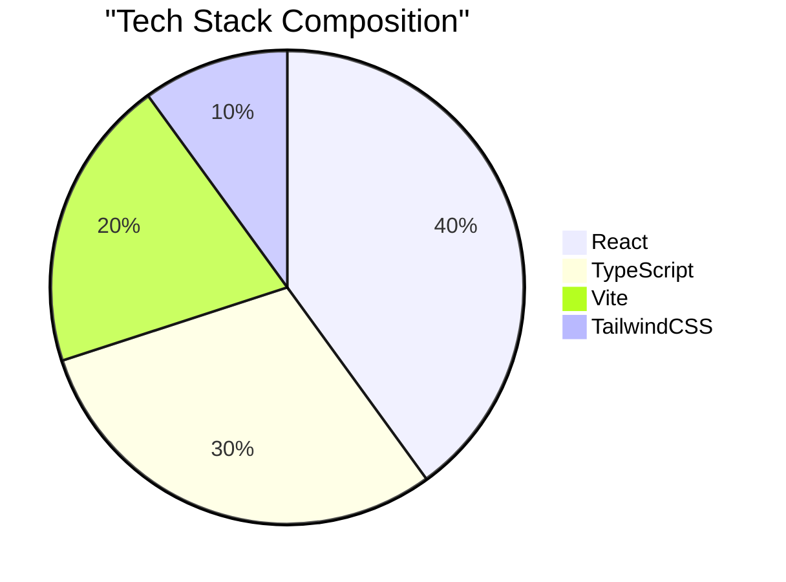
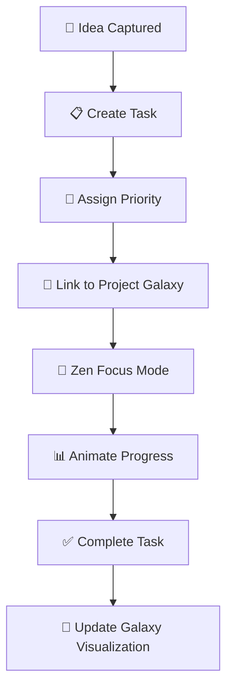

# 🌌🪐 AETHERLIST: Your Universe of Tasks 🚀🛸

> _"Where productivity transcends orbit and your goals align like stars in a cosmic constellation."_

[](https://opensource.org/licenses/MIT)
[](https://vitejs.dev/)
[](https://github.com/yourusername/aetherlist)
[](https://github.com/yourusername/aetherlist)

<div align="center">
  
</div>

---

## 🌠 Overview

**AetherList** is a celestial productivity platform that lets you visualize, prioritize, and manage your tasks like a living galaxy. Each task is a star. Each project a galaxy. Your mind? A universe of potential.

Whether you're launching your next project or planning your week, AetherList helps you find cosmic clarity through orbital task design, Zen focus mode, and animated progress stardust. 🧘‍♀️✨

---

## 💫 Key Features

| Feature                         | Description                                                                                  |
|----------------------------------|----------------------------------------------------------------------------------------------|
| 🪐 **Cosmic Prioritization**     | Tasks have gravity — the bigger the priority, the stronger the pull                         |
| 🌌 **Task Universe**             | Visual galaxy of projects, each task orbiting in harmony                                    |
| 🧘 **Zen Focus Mode**            | Ambient cosmic sounds + visuals to help you reach deep work states                          |
| 🎆 **Animated Progress**         | Beautiful visualizations that evolve as you complete tasks                                  |
| 🔁 **Live Evolution**            | Watch tasks move and shift as your focus changes                                            |
| 💡 **Galaxy Builder UI**         | Drag and drop interface for managing subtasks as stars in a constellation                   |

---

## 🧠 Cosmic Concepts

- **🌠 Gravitational Priority** – Tasks with higher priority orbit closer to your attention
- **🌀 Task Nebulae** – Clusters of related subtasks evolve as you work
- **🛸 Time-Warp Focus Mode** – Enter a time-altered Zen state to destroy distraction asteroids

---

## ⚙️ Tech Stack



## 🌀 Task Lifecycle Flow



## 🚀 Getting Started

**📦 Prerequisites**

Node.js (v16+)
npm or yarn

## ⚙️ Installation

```bash

# Clone the repository
git clone https://github.com/yourusername/aetherlist.git
cd aetherlist

# Install dependencies
npm install
# OR
yarn install

# Start the development server
npm run dev
# OR
yarn dev

```

## 🛠 Build for Production

```bash

npm run build
# OR
yarn build

# Preview production build locally
npm run preview
# OR
yarn preview

```

## 🧪 Testing

```bash

# Run test suite
npm run test
# OR
yarn test

# Run tests with coverage
npm run test:coverage
# OR
yarn test:coverage

```

## 📄 License

This project is licensed under the MIT License - see the LICENSE file for details.

```<div align="center"> <h3>💫 May Your Tasks Forever Orbit in Harmony</h3> <p>Launch into productivity with purpose and peace. <br> Powered by the cosmos. 🛸</p>  </div> ```


